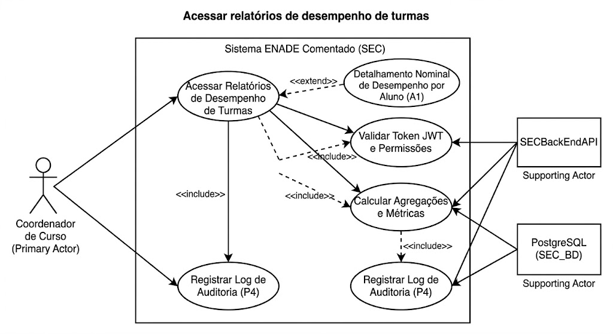

# Especificação de Requisitos Funcionais

## Caso de Uso (CDU) - (Sistema ENADE Comentado - SEC)

## Histórico de Versões

| Data       | Versão | Descrição                                                                                          | Autor         |
| ---------- | ------- | -------------------------------------------------------------------------------------------------- | ------------- |
| 27/05/2026 | 1.0     | Criação inicial do caso de uso com base no requisito F4.6 da Visão da Demanda.                     | Juliana       |
| 07/06/2026 | 1.1     | Ajustes gerais                  | Juliana       |

## 1. Nome do Caso de Uso

Acessar relatórios de desempenho de turmas

## 2. Objetivo

Permitir ao Coordenador de Curso visualizar e filtrar dados estatísticos de rendimento das turmas sob sua gestão dentro de um período delimitado, mapeando o percentual de acertos por eixos temáticos do INEP para subsidiar tomadas de decisão pedagógicas.

## 3. Tipo de Caso de Uso

Concreto.

## 4. Atores

### 4.1 Primário

| Ator | Descrição |
|---|---|
| Coordenador de Curso | Responsável pela gestão acadêmica do curso de graduação |

### 4.2 Secundário

| Ator | Descrição |
|---|---|
| SECBackEndAPI | API Node.js responsável por realizar agregações matemáticas, validar o escopo do curso e fornecer dados em JSON |
| PostgreSQL (SEC_BD) | SGBD responsável pela extração das respostas históricas, dados de turmas e persistência dos logs |

## 5. Precondições

| Código | Descrição |
|---|---|
| PRE01 | O Coordenador de Curso deve estar autenticado no sistema com token JWT válido e perfil de acesso ativo (`F4.1` / `RNF-017`) |
| PRE02 | O Coordenador de Curso deve possuir um vínculo institucional exclusivo configurado com seu respectivo curso (`F4.8`) |
| PRE03 | Devem existir dados de simulados previamente concluídos e computados pelos alunos do curso para gerar amostragem (`RNF-039`) |

## 6. Fluxo Principal

### P1. Solicitar acesso ao módulo de relatórios gerenciais

O Coordenador de Curso acessa a dashboard através de um navegador homologado (`RNF-008`) e aciona a opção "Desempenho de Turmas".

### P2. Renderizar indicadores macro da área

A API backend intercepta a requisição via tráfego seguro HTTPS TLS 1.3 (`RNF-013`), decodifica o token JWT para identificar o curso do gestor (`RN2`) e calcula os indicadores agregados. O painel em React renderiza os gráficos macro em menos de 3 segundos (`RNF-002`).

### P3. Parametrizar filtros de busca

O Coordenador utiliza os componentes visuais reutilizáveis (`RNF-031`) para refinar a pesquisa, selecionando a Turma específica, o **Período limite (Data Início e Data Fim)** e o Tipo de Componente (Formação Geral ou Conhecimento Específico).

### P4. Exibir matriz de desempenho por subcategoria e registrar log

A interface atualiza os dados em tempo de execução, exibindo tabelas comparativas e gráficos de barras com a média de acertos segregada pelas subcategorias de área/tema oficiais do INEP (`RNF-042`), destacando criticamente os temas com rendimento abaixo do esperado (`RNF-028`). Simultaneamente, o sistema grava uma trilha de auditoria imutável (`RNF-016`) contendo as credenciais do coordenador, a turma consultada, os filtros aplicados e o timestamp da operação.

## 7. Fluxos Alternativos

### A1. Detalhamento nominal de desempenho por aluno

#### A1.1. No passo P4 do fluxo principal, o Coordenador necessita auditar quais discentes necessitam de atenção individualizada.
#### A1.2. O Coordenador acessa a seção "Detalhamento por Aluno" acoplado à listagem da turma, retornando ao passo P4 para continuidade da consulta.

## 8. Fluxos de Exceção

### E1. Inexistência de dados processados para os filtros aplicados

#### E1.1. No passo P4, ao aplicar os filtros de turma e **período**, o sistema constata que nenhuma avaliação foi concluída para aquele cenário.
#### E1.2. A solução impede a quebra de renderização dos componentes de gráficos de terceiros (`RNF-030`).
#### E1.3. O sistema exibe um aviso amigável informando que não há amostragem estatística suficiente para o escopo selecionado (`RNF-028`).

### E2. Quebra de integridade ou expiração do token de coordenação

#### E2.1. Durante qualquer requisição de agregação (passos P2 ou P4), a API backend detecta que a sessão do usuário expirou ou o token JWT foi violado.
#### E2.2. A solução anula a consulta no PostgreSQL para mitigar vazamentos de informações sensíveis ou violações à LGPD.
#### E2.3. O sistema redireciona o usuário para a tela de autenticação inicial com uma mensagem de sessão encerrada.

## 9. Pós-condições

| Código | Descrição |
|---|---|
| POS01 | As métricas de monitoramento pedagógico da turma permanecem visíveis e atualizadas em cache para consultas rápidas ou refinamentos de filtros |
| POS02 | A trilha de logs do PostgreSQL armazena o histórico de consulta de dados coletivos da turma, em conformidade com as diretrizes (`RNF-016`) |

## 10. Requisitos Não Funcionais

| Código | Requisito |
|---|---|
| RNF01 | O tempo de agregação e plotagem gráfica dos relatórios não deve ultrapassar 3 segundos (`RNF-002`) |
| RNF02 | Os gráficos gerados devem ser responsivos e legíveis em telas a partir de 360px de largura (`RNF-007`) |
| RNF03 | O processamento gráfico local no React não deve causar vazamento de memória ou estourar o limite de 150MB (`RNF-005`) |
| RNF04 | Garantia absoluta de isolamento lógico: um coordenador jamais poderá acessar relatórios de cursos terceiros (`RN2` / `RNF-017`) |
| RNF05 | Todos os componentes de gráficos de linha/pizza devem possuir rótulos textuais compatíveis com leitores de tela (`RNF-027`) |
| RNF06 | Armazenamento de logs com hashing de segurança para garantir a imutabilidade do registro de acesso do gestor (`RNF-016`) |
| RNF07 | Interface limpa e minimalista baseada em dashboards executivos para evitar sobrecarga cognitiva (`RNF-029`) |

## 11. Ponto de Extensão

Não se aplica.

## 12. Frequência de Utilização

Média. Uso recurrent em reuniões de Núcleo Docente Estruturante (NDE), encerramentos de módulos acadêmicos e imediatamente após simulados institucionais unificados.

# 13. Interface Visual

## IV1. Dashboard de Monitoramento e Estatística de Turmas

### Layout da Tela

Painel analítico composto por uma barra de filtros rápidos no topo, cartões de métricas gerais ao centro e gráficos dinâmicos de barras cruzando subcategorias INEP com percentuais de proficiência.

---

## 13.1 Campos da Interface

| Campo | Tipo/Formato | Obrigatório | Descrição | Regra de Negócio / RNF |
|---|---|---|---|---|
| Token de Acesso | JWT / Interno | Sim | Credencial armazenada que valida o escopo do usuário | Bloqueia dados de outros cursos (`RN2` / `RNF-017`) |
| Curso Gestor | Texto (Bloqueado) | Sim | Exibe o curso do coordenador de forma estática | Preenchido automaticamente via token |
| Filtro de Turma | Lista de Seleção | Sim | Combo contendo as turmas ativas do curso | Filtra a base de alunos correspondente |
| Data Início | Campo de Data | Sim | Define o início do período de busca dos simulados realizados | Formato DD/MM/AAAA |
| Data Fim | Campo de Data | Sim | Define o término do período de busca dos simulados realizados | Formato DD/MM/AAAA; Deve ser igual ou maior que a Data Início |
| Tipo de Componente | Radio Group | Sim | Alterna entre Formação Geral, Conhecimento Específico ou Ambos | Segue classificação INEP (`RN1` / `RNF-042`) |
| Card Média Geral | Indicador Numérico | Sim | Exibe o percentual consolidado de acertos da turma | Atualizado dinamicamente via JSON (`RNF-035`) |
| Gráfico de Proficiência | Componente Canvas | Sim | Gráfico de colunas ilustrando as subcategorias do ENADE | Suporte a alto contraste e hover de dados (`RNF-027`) |
| Tabela de Alunos | Grid de Dados | Sim | Listagem nominal com notas individuais e progresso | Permite ordenação por cabeçalho de coluna |

---

## 13.2 Navegabilidade

| Ação | Resultado |
|---|---|
| Alterar a Turma ou o Período | A interface React entra em estado de carregamento e atualiza todos os cards e gráficos em menos de 3 segundos (`RNF-002`) |
| Passar o mouse sobre uma barra do Gráfico | O sistema exibe um tooltip flutuante detalhando o nome da subcategoria e a quantidade exata de questões respondidas |
| Clicar no cabeçalho "Nota" da Tabela | O sistema ordena os alunos de forma crescente ou decrescente localmente sem recarregar a página |

---

## 13.3 Mensagens Previstas

| Código | Mensagem |
|---|---|
| MSG001 | Compilando dados estatísticos da turma. Por favor, aguarde... |
| MSG002 | Sem registros. A turma selecionada ainda não realizou simulados no período informado. |
| MSG003 | Intervalo inválido. A data de término do período não pode ser anterior à data de início. |

---

## 13.4 Componentes Visuais

| Área | Componente |
|---|---|
| Topo da Página | Header administrativo com identificação do curso e linha horizontal contendo os filtros Dropdown, seletores de calendário (Datepickers) e seletores Radio |
| Painel Central (KPIs) | Linha de cartões (Cards) com sombras suaves exibindo números grandes em cores destacadas (Verde para alta performance, Laranja/Vermelho para atenção) |
| Área de Gráficos | Bloco centralizado utilizando a biblioteca Chart.js responsiva com legendas interativas |
| Seção de Listagem | Tabela zebrada em cores neutras (`RNF-029`) com paginação integrada a cada 10 registros e botão para expansão de dados do discente |
| Rodapé da Página | Links e botões institucionais minimalistas para retorno seguro ao menu principal da coordenação |

---

## 14. Observações

Não se aplica.

## 15. Referências

* Visão da Demanda (VD) - Seção 6 (Funcionalidades F4.1, F4.6 e F4.8).
* Regras de Negócio da Solução (RN) - Identificadores RN1 (Estrutura INEP), RN2 (Limitação por área/curso) e RN5 (Trilha de auditoria).
* Especificação de Requisitos Não Funcionais (RNF) - Itens RNF-002, RNF-005, RNF-007, RNF-008, RNF-013, RNF-016, RNF-017, RNF-027, RNF-028, RNF-029, RNF-030, RNF-031, RNF-035, RNF-039 e RNF-042.
* Diagrama de Caso de Uso (`../Imagens/diagrama_casos_de_uso_v3.png`).
